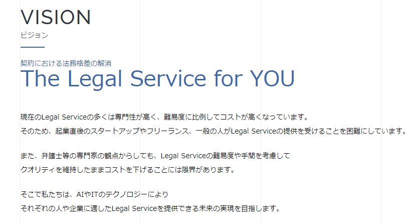

## Auth0 in Microservices

### ～リーガルテックの事績～

---

# リーガルテック？

---

法律関連のレガシー・労働集約型の領域を
<br/>
テクノロジーで代替していく

---

#### 特に法務はレガシー

---

- 契約による法的拘束力は恐ろしい
- 契約書は十分なチェックが必要
* 多大な労力と時間がかかる

---

- 権利義務関係の明確化
- リスクコントロール
    * 競業禁止規定
    * 任意解除規定
    * 賠償額と条件
    * etc

---

## これら全てを<br/>**目視チェック**

---

## 知識・スキルの属人化

---

#### 法律は全ての人に等しく適用される
:arrow_up_down:
#### 経験を積んだ人以外には法務業務は難しい

---

# [GVA TECH](https://gvatech.co.jp/)

---



---

スタートアップ・フリーランスを中心に
<br/>
サービス展開してきた

---

| [AI-CON](https://ai-con.lawyer/) | [AI-CON登記](https://corporate.ai-con.lawyer/) |
| -------------------------------- | ---------------------------------------------- |
| 契約書チェックを<br/>AIで行う    | 法人の登記書類の作成を<br/>オンラインで行う    |

---

大企業の法務も同じ課題を抱えている

---

# [AI-CON Pro](https://ai-con-pro.com/)

---

## 目次

* マイクロサービス化の流れ
* Auth0の使いどころ

---

# マイクロサービス化の流れ

---

### 契約書レビュー（ざっくり）

```
1. これから結ぶ契約書の草案を受け取る
2. ひな型契約書（自社にとっての理想形）と照らし合わせる
3. 草案修正
4. 修正版を契約書の締結相手に送る
5. 1~4を繰り返す
```
- 2:point_right:Wordで行うことが殆ど
- 3:point_right:条文単位で行う。草案とひな型の条文順が異なり、照らし合わせが大変

---

### サービス概要

* 大企業法務向け
* Word add in
* セキュリティ最重視

---

#### 使用技術

- client
  - 言語: TypeScript
  - FW: vue.js
- API
  - 言語: Go
  - FW: Buffalo
- DB
  - Aurora MySQL

---

最初期


---

### 仕様変更

---

| 大企業                                | スタートアップ<br/>フリーランス   |
| ------------------------------------- | --------------------------------- |
| ひな型を持っていたり<br/>いなかったり | 契約書のひな型を<br/>持っていない |

---

| 大企業                                                | スタートアップ<br/>フリーランス     |
| ----------------------------------------------------- | ----------------------------------- |
| ひな型を持っていたり<br/>いなかったり                 | 契約書のひな型を<br/>持っていない   |
| 顧客企業作成・GVA TECH作成<br/>両方のひな型でレビュー | GVA TECH作成の<br/>ひな型でレビュー |

---

システム上の問題点

* ひな型契約書のセキュリティレベルが異なる
  * GVA TECH作成と顧客作成でひな型DBは分けるべき
* セキュリティレベルが異なる=認証のスコープが異なる
  * OAuth2フローに従うと、リソースサービスはAPIとDBの1対1対応が必要
  * つまり、 DBを分けたらリソースAPIも分ける

---
最初期


---

仕様増えた。。。

---

ここが潮目では。

---

#### マイクロサービス化を徹底するぞ

---

柔軟＆堅牢な開発のため、徹底しよう

* スキーマ駆動開発
* テスト駆動開発
* アジャイル開発

---

どちらのひな型でも契約書レビュー
- GVA TECH作成
- 顧客作成

---

### 草案条文とひな型条文の<br/>マッチ精度を上げたい

---

#### 使用技術

- client
  - 言語: TypeScript
  - FW: vue.js
- API
  - 言語: Go
  - FW: Buffalo
- DB
  - Aurora MySQL
  * elasticsearch
---

elasticsearch投入


---

### EC2が増えすぎている

---

コンテナ管理をしよう

---

追加使用技術
- IaC
    - terraform
- CI/CD
    - Fargate
    - ECS
    - CircleCI

---

コンテナ管理する


---

### もっと精度を上げたい

---
追加使用技術
- ML
  - SageMaker
---

機械学習する


---

### やりきった!!

---

### やりきった...?

---

### サービス概要

* 大企業法務向け
* Word add in
* セキュリティ最重視

---

### さあ認証だ

---


---

:fearful:どうすればいいの:worried:

---

# Auth0の<br/>使いどころ

---

- customDB
- トークン検証API
- 他

---

## customDB

---

ユーザデータの格納場所

* user_metadata or app_metadata
  * [profileの項目以外のデータを格納する場所](https://auth0.com/docs/users/references/user-profile-structure#user-profile-attributes)
  * [userに操作させたい情報はuser_metadataを使用](https://community.auth0.com/t/differences-between-client-metadata-and-app-metadata/21388/2)
* 顧客データがuser_metadataに収まらないかも
  * [user_metadataは合計16MBまで](https://auth0.com/docs/users/concepts/overview-user-metadata#metadata-best-practices)
  * [userあたり10項目まで](https://auth0.com/docs/users/references/metadata-field-name-rules#metadata-size-limits)
  * [custom DBを構築するのがよい](https://community.auth0.com/t/metadata-size-limits/6662)

---

customDB データ連携
* customDBをpublicに晒さないため、APIを挟む
* Database Connectionsを設定し、<br/>ActionScriptsによりAPIへCRUDリクエスト


---

## トークン検証API

---
構築経緯

* マイクロサービス化により、リソースAPIが複数
* リソースAPIの個数分のトークン検証処理コード
  * 処理統一の必要 ⇔ 処理がばらつく恐れ
  * DRY原則
* トークン検証処理をAPI化して、リクエストを送る

---

技術選定

* ~~API Gateway + Lambda~~
  * AWS SAMの導入
  * 多くのAPIからリクエストを受け続けるので、lambdaの恩恵があまり無い
* Buffallo API
  * 他のコンテナと同一基盤に載せた方が無難

---

### 躓きポイント

---

#### Auth0 SDKがjwt-goのError情報を塗り替える

---

[auth0/go-jwt-middleware](https://github.com/auth0/go-jwt-middleware)の抜粋
※[dgrijalva/jwt-go](https://github.com/dgrijalva/jwt-go)に依存（package名: jwt）
```go
func (m *JWTMiddleware) CheckJWT(w http.ResponseWriter, r *http.Request) error {
中略
    // Now parse the token
	parsedToken, err := jwt.Parse(token, m.Options.ValidationKeyGetter)

	// Check if there was an error in parsing...
	if err != nil {
		m.logf("Error parsing token: %v", err)
		m.Options.ErrorHandler(w, r, err.Error())
		return fmt.Errorf("Error parsing token: %v", err)
    }
中略
	// Check if the parsed token is valid...
	if !parsedToken.Valid {
		m.logf("Token is invalid")
		m.Options.ErrorHandler(w, r, "The token isn't valid")
		return errors.New("Token is invalid")
	}
中略
}
```

@[5](jwt-goの正常値とエラー値の返却)
@[8](エラーハンドリング箇所)
@[10](error型ではなく、err.Error()でstring化して引数に渡す)
@[11](jwt-goのエラー情報が失われた状態でフォーマットし、返却)
@[19](他の箇所では独自生成したstringを渡している)

---

[jwt-goで提供されているerrorの種類](https://github.com/dgrijalva/jwt-go/blob/master/errors.go#L15-L43)

```go
// The errors that might occur when parsing and validating a token
const (
	ValidationErrorMalformed        uint32 = 1 << iota // Token is malformed
	ValidationErrorUnverifiable                        // Token could not be verified because of signing problems
	ValidationErrorSignatureInvalid                    // Signature validation failed

	// Standard Claim validation errors
	ValidationErrorAudience      // AUD validation failed
	ValidationErrorExpired       // EXP validation failed
	ValidationErrorIssuedAt      // IAT validation failed
	ValidationErrorIssuer        // ISS validation failed
	ValidationErrorNotValidYet   // NBF validation failed
	ValidationErrorId            // JTI validation failed
	ValidationErrorClaimsInvalid // Generic claims validation error
)
```

---

[err.Error()の実装](https://github.com/dgrijalva/jwt-go/blob/master/errors.go#L39-L54)

```go
// The error from Parse if token is not valid
type ValidationError struct {
	Inner  error  // stores the error returned by external dependencies, i.e.: KeyFunc
	Errors uint32 // bitfield.  see ValidationError... constants
	text   string // errors that do not have a valid error just have text
}

// Validation error is an error type
func (e ValidationError) Error() string {
	if e.Inner != nil {
		return e.Inner.Error()
	} else if e.text != "" {
		return e.text
	} else {
		return "token is invalid"
	}
}
```
@[4](前ページのエラーの種類を受けるメンバー)
@[9](返り値はstring)
@[11](メンバーErrorsは返却されない)

---
* ErrorHandlerを独自実装可能だが、<br/>error型ではなくstring型が引数に指定されている
  * 値がstring化されると、<br/>エラーメッセージで判別することになり、脆弱
* APIでのエラーハンドリングが困難になるため、auth0/go-jwt-middlewareは使用しない
  * dgrijalva/jwt-goを用いて直接実装することとした

---

#### jwtの要素の型がぶれる

---

- Auth0から返却されるjwtの要素のうち、<br/>型が固定でないものがある
  - audienceの型が<br/>値が単一の場合string、複数の場合string配列
  - goでは、型が不定な返却値は扱いづらい
* [jwt-go側のIssueにも挙げられている](https://github.com/dgrijalva/jwt-go/issues/348)
  * [PRも既に出ている](https://github.com/dgrijalva/jwt-go/pull/355)
  * このPRのmergeが間に合わなかったため、<br/>該当箇所を独自実装することとした

---

#### 最終的に
---


---

### その他やっていること

* Connections
  * social login
* Rules
  * srcIP制限
  * MFA

---

### 今後やっていくこと

- トークン検証API廃棄
  - 処理のプライベートパッケージ化
- 各テナント間でCI/CDを回す
- ActionScriptのTypeScript化

---

## [AI-CON Pro](https://ai-con-pro.com/)
## [β版リリース](https://prtimes.jp/main/html/rd/p/000000030.000033386.html)
## 問い合わせ受付中
